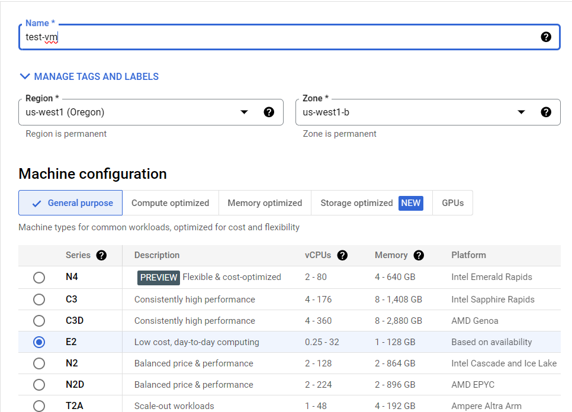
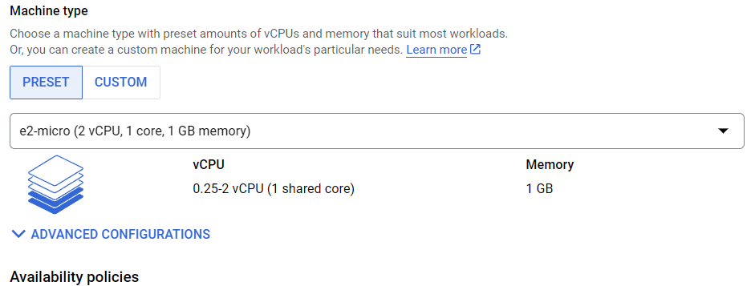
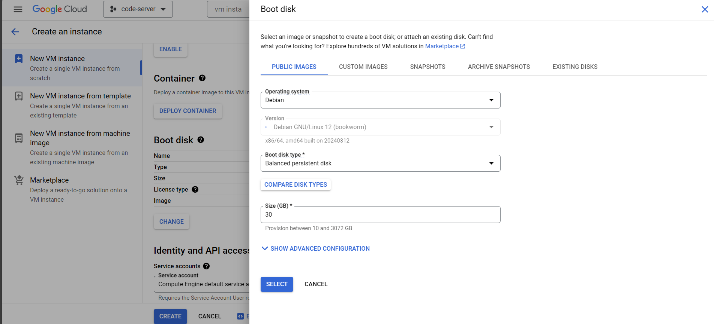

# Workshop

## 1. Set up your VM on GCP

### a. Enable the free tier

- Visit [https://cloud.google.com/](https://console.cloud.google.com/)
- Enable the free tier by searching for it or visiting [https://console.cloud.google.com/freetrial/signup](https://console.cloud.google.com/freetrial/signup)


`
Start your free trial with $300 in credit. Don't worry – you won't be charged if you run out of credit.
`

- Enter your card details.

You will **NOT** be charged if you are only using the free tier. This is just so Google can verify its users for the free trial. You don’t have to worry about any expenses. **This is completely free.**

### b. Create a free VM instance

Follow these steps exactly to create a VM that qualifies for the free tier. You can keep using it as long as you want without being charged.

- Search for ‘Add VM Instance’ or visit this link: [https://console.cloud.google.com/compute/instancesAdd](https://console.cloud.google.com/compute/instancesAdd)

1. Name your VM
2. Select only these regions: us-west1, us-central1 and us-east1
3. Any zone within these regions is fine
4. Under 'Machine Configuration', select the E2 series.

5. Select the e2-micro Machine Type.

6. Change the boot disk size to 30 GB (only if your account has 1 VM!)

7. Enable HTTP and HTTPS Traffic under 'Firewall'
8. Expand 'Advanced Options' and under 'Networking' expand the default interface.
9. Click 'Reserve Static External IP address' in the 'External IPv4 address' option.
10. Enter a name for the IP address and click 'DONE' to save the IP.
11. Create the VM


# 2. Install Docker on the VM

- View all your VMs by visiting [https://console.cloud.google.com/compute/instances](https://console.cloud.google.com/compute/instances) or by searching ‘VM instances’ in the search bar
- Click SSH under the Connect column.
- Refer [https://docs.docker.com/engine/install/ubuntu/](https://docs.docker.com/engine/install/ubuntu/) to install docker engine or just copy-paste this block in the terminal. This will install the docker repository to allow you to get the latest version of docker.

```bash
# Add Docker's official GPG key:
sudo apt-get update
sudo apt-get install ca-certificates curl
sudo install -m 0755 -d /etc/apt/keyrings
sudo curl -fsSL https://download.docker.com/linux/debian/gpg -o /etc/apt/keyrings/docker.asc
sudo chmod a+r /etc/apt/keyrings/docker.asc

# Add the repository to Apt sources:
echo \
  "deb [arch=$(dpkg --print-architecture) signed-by=/etc/apt/keyrings/docker.asc] https://download.docker.com/linux/debian \
  $(. /etc/os-release && echo "$VERSION_CODENAME") stable" | \
  sudo tee /etc/apt/sources.list.d/docker.list > /dev/null
sudo apt-get update
```

- To install the latest version, run:

```bash
sudo apt-get install docker-ce docker-ce-cli containerd.io docker-buildx-plugin docker-compose-plugin
```

- Verify that the Docker Engine installation is successful by running the `hello-world` image.

```bash
sudo docker run hello-world
```

You have now successfully installed and started Docker Engine.

- Add your user to the docker group to use docker without sudo.

```bash
sudo groupadd docker
sudo usermod -aG docker $USER
newgrp docker
```

- Test by running hello-world again without sudo

```bash
docker run hello-world
```

# What is Docker?

Before we start using Docker, let's take a step back and understand the concept of containerization.

Imagine you're moving to a new house. Instead of packing all your belongings into individual boxes and transporting them separately, you decide to use shipping containers. These containers can hold everything you need, from furniture to kitchen appliances, in a neat and organized manner. Plus, they're standardized, making it easier to move them around efficiently.

Now, let's relate this to software development. Traditionally, when you build an application, you have to deal with various dependencies, libraries, and configurations. It's like packing your belongings into separate boxes, each representing a different component of your application. This can get messy and cumbersome, especially when you want to deploy your application across different environments.

This is where containerization comes in. Just like shipping containers streamline the process of moving belongings, containers in software development encapsulate everything your application needs to run smoothly. They include the code, runtime, system tools, libraries, and settings, all bundled together in a lightweight package. And just like shipping containers, containers are standardized, making them easy to deploy and manage across different platforms.

In summary, Docker containers offer a lightweight and efficient way to package and deploy applications, thanks to containerization. They provide isolation without the overhead of running multiple virtual machines, making them ideal for modern, scalable, and portable software development.

**Docker Images:**

Think of a Docker image as a blueprint or a snapshot of a software application and its dependencies at a specific point in time. It contains everything needed to run an application: the code, runtime, libraries, dependencies, and configuration files.

Creating a Docker image is like creating a recipe for your application. You specify the ingredients (dependencies), the steps to prepare them (installation instructions), and any special instructions (configuration settings). Once you have this recipe defined in a Dockerfile, you can build it into an image using the Docker build command.

Docker images are stored in a registry, like Docker Hub, where they can be shared and reused by others. This makes it easy to distribute applications and ensures consistency across different environments.

**Docker Containers:**

Now, let's talk about containers. A Docker container is a running instance of a Docker image. It's like a lightweight, isolated environment that encapsulates your application and its dependencies.

When you run a Docker container, you're essentially launching a process or a set of processes within that isolated environment. Each container has its own filesystem, networking, and resources, but shares the same underlying kernel with the host machine.

Containers are designed to be ephemeral and disposable. You can start, stop, delete, and replace them on the fly without affecting the host system or other containers. This makes containers ideal for microservices architectures, where applications are broken down into smaller, independent components that can be deployed and scaled independently.

In summary, Docker images are like blueprints for your applications, while Docker containers are the running instances of those blueprints. Images define what goes into your application, while containers provide the environment for your application to run. Together, they form the foundation of modern, containerized application development and deployment.


I’m aware it’ll take a while for all these concepts to settle in, but once you actually start using docker containers, this will seem really easy.

# 3. Install nginx

## a. Use docker compose to spin up the container

There are two ways to run docker containers, either by using docker run or by using docker compose.

When you use docker run, you type the command docker run and enter the container details. I prefer using docker compose as all the container settings can be saved on the file and you can just run the file directly.

- Make a new folder called nginx

```bash
mkdir nginx

cd nginx
```

- In the folder, make a new file called docker-compose.yml We will use the nano text editor.

```bash
nano docker-compose.yml
```

- Copy this code

```yaml
---
version: "3.4"

networks:
  proxy:
    name: proxy

services:
  app:
    image: 'jc21/nginx-proxy-manager:latest'
    restart: unless-stopped
    container_name: nginx
    
    ports:
     - '80:80' # Public HTTP Port
     - '443:443' # Public HTTPS Port
     - '81:81' # Admin Web Port

    volumes:
      - ./data:/data
      - ./data/nginxx/snippets:/snippets:ro
      - ./data/nginx/site-confs:/site-confs:ro
      - ./letsencrypt:/etc/letsencrypt
    
    networks:
      - proxy
```

- Paste this into the nano window by pressing CTRL+SHIFT+V. Save it by pressing CTRL+O and then enter. Exit nano by pressing CTRL+X.

I will explain each part of the YAML file

- Now, run the docker container by using docker compose:

```bash
docker compose up -d
```

## b. Allow port 81 through the firewall

- Configure your firewall to allow port 81 from the VM to be accessed.
- Search for firewall or visit [https://console.cloud.google.com/net-security/firewall-manager/firewall-policies/list](https://console.cloud.google.com/net-security/firewall-manager/firewall-policies/list)
- Create a new firewall rule. Make sure to select rule not policy


- Add the target tags as ‘http-server’ and https-server’
- Set the IPv4 range as 0.0.0.0/0. This will allow access to all IP addresses.


- Set the UDP and TCP ports to 81


- Create the firewall rule

## c. Set up nginx

- Note the external IP address of your VM by going to the ‘VM Instances’ page. Click on the External IP link to visit it. Add ’:81’ after the link to visit port 81. Make sure it is http, not https.
- Example, if your IP is `34.168.85.73`, visit `http://34.168.85.73:81/`
- Login with the following details:

```
Email:    admin@example.com
Password: changeme
```

- Change the default details, and ensure you use a strong password as security is very important.

# What is a Reverse Proxy?

What is NGINX and why are we installing it? Well, NGINX is a reverse proxy. A reverse proxy is a very important tool that is necessary for maintaining security and convenience while self hosting.

**Proxy:**

Imagine you're at a fancy restaurant, and you want to order some food from the kitchen. But instead of walking all the way to the kitchen yourself, you have a waiter who takes your order and brings the food back to your table. That's kind of like what a proxy does in the world of computers.

In simple terms, a proxy is like a middleman that sits between you (your computer or device) and the internet. When you want to access a website or an online service, instead of connecting directly to it, your request goes through the proxy server first. The proxy then forwards your request to the destination, receives the response, and sends it back to you.

**Reverse Proxy:**

Now, let's talk about reverse proxy. Imagine you're hosting a big party at your house, and you're expecting a lot of guests. Instead of having everyone come directly to your front door, which might get crowded and chaotic, you set up a reception area outside where guests check in first. This reception area helps manage the flow of guests and directs them to the right places inside your house.

In the world of servers and websites, a reverse proxy works in a similar way. It sits in front of web servers and acts as a gateway for incoming requests from clients (like web browsers). When a client wants to access a website, the request goes to the reverse proxy first. The reverse proxy then forwards the request to the appropriate server hosting the website, receives the response, and sends it back to the client.

So, why use a reverse proxy? Well, it offers several benefits. It can improve security by hiding the details of your web servers and providing a single entry point for incoming traffic. It can also help with load balancing, distributing incoming requests across multiple servers to ensure smooth performance and prevent any single server from getting overwhelmed.

In summary, a reverse proxy is like a receptionist for your website, helping manage incoming requests and directing them to the right place behind the scenes. It's a handy tool for improving security, scalability, and performance in the world of web hosting and server management.


# 4. Obtain a custom domain

Until now, we have been using a lengthy IP Address to access our admin page. However, so that our page resembles more like an actual site, we will use a domain name. Domain names usually start at around 500 Rupees per year. If you want your own domain name, you can definitely purchase one. The free option is to use subdomains and that’s exactly what we’re going to do today.

- Visit [https://dynu.com](https://dynu.com) and make a free account.
- Once you have successfully verified your account, visit [https://www.dynu.com/en-US/ControlPanel/AddDDNS](https://www.dynu.com/en-US/ControlPanel/AddDDNS) to create your subdomain.


- Once you have created the subdomain of your choice, point it to the external IP of your VM. Paste the External IP of your VM in the IPv4 Address field and save it.


- Click on API Credentials (the puzzle icon) and Generate an API Key.


- Copy the API key somewhere safe as we will use it later.

# What is SSL?

Remember how I told you to visit HTTP instead of HTTPS when we were opening the admin panel? The browser shows a warning: ‘Not Secure’. This is due to the fact that HTTP is not secure at all, any traffic you send through it is unencrypted. Anybody spying over your network can easily see the data you’re sending.

To use HTTPS, we need to generate SSL Certificates.  SSL certificates are digital certificates that provide secure, encrypted communication between a web server and a user's web browser.

# 5. Set up certificates and domains on nginx

## a. Obtain a certificate

- Visit the admin panel of nginx again.
- Navigate to the SSL Certificates page.
- Click on add SSL Certificate and select ‘Let’s Encrypt’.


- Enter the custom subdomain that you created in the previous step. Also add another domain which is *. followed by the subdomain you created.
Example: `rkcloud.mywire.com` and `*.rkcloud.mywire.org`
- Enable ‘Use a DNS Challenge’.
- Select Dynu as the DNS Provider.
- Replace YOUR_DYNU_AUTH_TOKEN with the API Credential generated earlier.
Example: `dns_dynu_auth_token = V5Xb4345bg633f64U5234Wf5g4d33c57`
- Leave the propagation seconds blank.
- Agree to the terms and conditions.
- This process may take a few minutes, so do not refresh the page until it is complete.
- If it isn’t generated successfully (the expiry date is red), delete it and try again.

## b. Create a domain and link it to the admin panel

- In the nginx admin panel, go to the ‘Proxy Hosts’ Page.
- Add a new proxy host. Under domain names, add nginx. followed by your subdomain.

    Example: if your subdomain is `rkcloud.mywire.org`, create the domain name as `nginx.rkcloud.mywire.org`.

- Leave the scheme as http.
- type `nginx` under forward hostname. (we can directly use the hostname as the different containers will be under the same network and can be called by their container names instead of IPs.)
- Use `81` as the Forward Port.
- Enable ‘Cache Assets’, ‘Block Common Exploits’ and ‘Websockets Support’.


- In the SSL tab, select the certificate you created to enable HTTPS support.
- Enable all the other options.


- Click save to create the domain.
- Click on the new domain to test it. It should load and be protected by HTTPS.

# 6. Install authelia

Before we install the code-server, we need to provide some authentication mechanism before we expose it to the internet. Authelia is a SSO (Single Sign On) tool that allows us to put out code-server behind a login.

## a. Docker Compose

- Navigate to the home directory on the server and create a folder called authelia

```bash
cd ~
mkdir authelia
cd authelia
```

- In the folder, make a new file called docker-compose.yml with the nano text editor.

```bash
nano docker-compose.yml
```

- Copy this code

```yaml
version: '3.3'

networks:
  proxy:
    external: true

services:
  authelia:
    image: authelia/authelia
    container_name: authelia
#   image: authelia/authelia:4.31
    volumes:
      - ./config:/config
    ports:
      - 9091:9091
    restart: unless-stopped
    healthcheck:
      disable: true
    environment:
      - TZ=Asia/Kolkata
    depends_on:
      - redis
    networks:
      - proxy

  redis:
    image: redis:alpine
    container_name: redis
    volumes:
      - ./redis:/data
    expose:
      - 6379
    restart: unless-stopped
    environment:
      - TZ=Asia/Kolkata
    networks:
      - proxy
```

- Paste this into the nano window by pressing CTRL+SHIFT+V. Save it by pressing CTRL+O and then enter. Exit nano by pressing CTRL+X.
- DO NOT run it with docker compose yet. We have to create the config files.

## b. Create the config file

- Create a new directory called config in the authelia folder.

```bash
mkdir config
cd config
```

- Paste this into notepad or any text editor on your computer. Don’t paste it in the VM as you will have to make some changes according to your subdomain.

```bash
##############################################################################
#                   Authelia configuration                                   #
##############################################################################

host: 0.0.0.0
port: 9091 # if you need this changed make sure it reflects also in the docker-compose.yml
jwt_secret: A4gYb7QFpbfKaNWAX7P7FX5y # CHANGE!! docker run authelia/authelia:latest authelia crypto rand --length 64 --charset alphanumeric
default_redirection_url: https://auth.rkcloud.mywire.org #CHANGE!!

authentication_backend:
  disable_reset_password: false
  file:
    path: /config/users_database.yml # Make sure this file exists
    password: 
      algorithm: argon2id
      iterations: 1
      salt_length: 16
      parallelism: 8
      memory: 64

access_control:
  default_policy: one_factor
  rules:
    # Rules applied to everyone
    - domain:
        - "https://auth.rkcloud.mywire.org" #CHANGE!!
      policy: bypass
    - domain: # Proxies only requiring username and password
        - "https://rkcloud.mywire.org" #CHANGE!!
      subject:
        - 'group:dev'
        - 'user:john' #CHANGE!!
      policy: one_factor
#      networks:
#        - 192.168.1.0/24
   # - domain: # Proxies needing 2 factor below
   #     - "proxmox.yourdomain.com"
   #   policy: two_factor
#      networks:
#         - 192.168.1.0/24
         
session:
  name: authelia_session
  # This secret can also be set using the env variables AUTHELIA_SESSION_SECRET_FILE
  secret: BEcQnvjxawGh4U9JgXBMXNVE
  expiration: 3600 # 1 hour
  inactivity: 7200 # 2 hours
  domain: rkcloud.mywire.org # CHANGE!! Needs to be your root domain

  redis:
    host: redis
    port: 6379
    # This secret can also be set using the env variables AUTHELIA_SESSION_REDIS_PASSWORD_FILE
#    password: authelia

regulation:
  max_retries: 5
  find_time: 2m
  ban_time: 10m

theme: dark   # options: dark, light

storage:
  encryption_key: y6PIvtsunfYFqgZzyZm5FfVBmykiHklWpszN92wvLBvhNGmXk7HgLvkOjW2Vj8m0
  local:
    path: /config/db.sqlite3
    
notifier:
  filesystem:
    filename: /config/notification.txt
#  smtp:
#    username: <your-user@your-email-domain.org>
#    password: <your-user-email-password-for-smtp>
#    host: <your-email-host-url-or-ip>
#    port: <your-email-port-for-smtp>  # 25 non-ssl, 443 ssl, 587 tls
#    sender: <sender@your-email-domain.org>
#    subject: "[Authelia] {title}"
#    disable_require_tls: false # set to true if your domain uses no tls or ssl only
#    disable_html_emails: false # set to true if you don't want html in your emails
#    tls:
#      server_name: <your-email-host-url-or-ip>
#      skip_verify: false
#      minimum_version: TLS1.2
```

**Line 8 (jwt_secret)** - Maybe add or change a few letters/numbers.

**Line 9 (default_redirection_url)** - add https://auth.your_subdomain.org to this.

Example: if your subdomain is `rkcloud.mywire.org`, add `https://auth.rkcloud.mywire.org` to the field.

**Line 26 (Access Control Domain 1)** - Change this to https://auth.your_subdomain.org as well.

Example: if your subdomain is `rkcloud.mywire.org`, add `https://auth.rkcloud.mywire.org` to the field.

**Line 29 (Access Control Domain 2)** - Change this to the subdomain only.

Example: if your subdomain is `rkcloud.mywire.org`, add `https://rkcloud.mywire.org` to the field.

**Line 32 (User)** - change this to your preferred username. Keep it simple and remember it as we will have to enter it exactly while creating the user database.  

**Line 48 (session domain)** - Change this to your root domain name.

Example: if your subdomain is `rkcloud.mywire.org`, add `rkcloud.mywire.org` to the field.

- In the VM, we are now in /authelia/config, Create a new config file called configuration.yml.

```bash
nano configuration.yml
```

- Paste the modified config into the nano window by pressing CTRL+SHIFT+V. Save it by pressing CTRL+O and then enter. Exit nano by pressing CTRL+X.

## c. Create users database file

- Paste this into notepad or any text editor on your computer. Don’t paste it in the VM as you will have to make some changes according to your username.

```yaml
###############################################################
#                         Users Database                      #
###############################################################
 
# This file can be used if you do not have an LDAP set up.
 
# List of users
users:
  john:
    displayname: "john doe"
    # SET password by generating hash with command
    #docker run authelia/authelia:latest authelia crypto hash generate --password 'YOURPASS'
    password: ""
    email: johndoe@gmail.com
    groups:
      - admins
      - dev
```

**Line 9 (john)** - Change it to the username entered in the config file.

**Line 10 (display name)** - Change it to the name of your choice.

**Line 13 (password)** - Generate a password hash by using the command `docker run authelia/authelia:latest authelia crypto hash generate --password 'YOURPASS'`  in the VM terminal. Change YOURPASS to your desired password  and copy the generated hash to this field in between the double quotes.

**Line 14 (email)** - Change it to your email

- Now we have to create the users_database.yml file. We should still be inside the /authelia/config directory.

```bash
nano users_database.yml
```

- Paste the following into users_database.yml and make sure to edit your name and email. Change ‘john’ to the username you used in the config file.

## d. Create the authelia container

- Within the ~/authelia directory, you can now run the docker-compose install.

```bash
cd ~/authelia
docker compose up -d
```

# 7. Set up authelia on nginx

Now that we have started authelia, we need to create its domain name on nginx so we can access it from the browser.

- In the nginx admin panel, go to the ‘Proxy Hosts’ Page.
- Add a new proxy host. Under domain names, add auth. followed by your subdomain.

    Example: if your subdomain is `rkcloud.mywire.org`, create the domain name as `auth.rkcloud.mywire.org`.

- Leave the scheme as http.
- type `authelia` under forward hostname. (we can directly use the hostname as the different containers will be under the same network and can be called by their container names instead of IPs.)
- Use `9091` as the Forward Port.
- Enable ‘Cache Assets’, ‘Block Common Exploits’ and ‘Websockets Support’.


- In the SSL tab, select the certificate you created to enable HTTPS support.
- Enable all the other options.


- In the advanced tab, paste the following code. This allows authelia to recieve information about the user like IP, etc. It also enables Authelia to act as an authenticator.

```perl
location / {
set $upstream_authelia http://authelia:9091; # This example assumes a Docker deployment 
proxy_pass $upstream_authelia;
client_body_buffer_size 128k;

#Timeout if the real server is dead
proxy_next_upstream error timeout invalid_header http_500 http_502 http_503;

# Advanced Proxy Config
send_timeout 5m;
proxy_read_timeout 360;
proxy_send_timeout 360;
proxy_connect_timeout 360;

# Basic Proxy Config
proxy_set_header Host $host;
proxy_set_header X-Real-IP $remote_addr;
proxy_set_header X-Forwarded-For $proxy_add_x_forwarded_for;
proxy_set_header X-Forwarded-Proto $scheme;
proxy_set_header X-Forwarded-Host $http_host;
proxy_set_header X-Forwarded-Uri $request_uri;
proxy_set_header X-Forwarded-Ssl on;
proxy_redirect  http://  $scheme://;
proxy_http_version 1.1;
proxy_set_header Connection "";
proxy_cache_bypass $cookie_session;
proxy_no_cache $cookie_session;
proxy_buffers 64 256k;

# If behind a reverse proxy, forwards the correct IP, assumes you're using Cloudflare. Adjust IP for your Docker network.
set_real_ip_from 172.18.0.0/16;
real_ip_header X-Forwarded-For;
real_ip_recursive on;
}
```

Do not edit anything that is not mentioned below unless you know exactly what you are doing

- Visit the domain for authelia, and test your username and password.

# 8. Install code-server

## a. Docker Compose

- Navigate to the home directory on the server and create a folder called code-server

```bash
cd ~
mkdir code-server
cd code-server
```

- In the folder, make a new file called docker-compose.yml with the nano text editor.

```bash
nano docker-compose.yml
```

- Copy this code

```yaml
---
version: "3.4"

networks:
  proxy:
    external: true

volumes:
  code_server_data:
    name: code_server_data

services:
  code-server:
    image: lscr.io/linuxserver/code-server:latest
    container_name: code-server
    restart: unless-stopped

    environment:
      - PUID=1000
      - PGID=1000
      - TZ=Asia/Kolkata
      # - PASSWORD=password #optional
      # - HASHED_PASSWORD=$$argon2i$$v=19$$m=4096,t=3,p=1$$R000UThTSmNkeDd2OTVLNQ$$saltedpasshash #optional
      - SUDO_PASSWORD=ZsudoZ556Z #optional
      # - SUDO_PASSWORD_HASH= #optional
      - PROXY_DOMAIN=code.rkcloud.mywire.org #CHANGE!!
      - DEFAULT_WORKSPACE=/config/workspace #optional
      - CS_DISABLE_GETTING_STARTED_OVERRIDE=false
      - CS_DISABLE_TELEMERTY=1

    volumes:
      - code_server_data:/config

    # ports:
    #   - 8556:8443
    
    networks:
      - proxy
```

- Make sure to change the proxy domain to your subdomain.
Example: if your subdomain is `rkcloud.mywire.org`, create the domain name as `code.rkcloud.mywire.org`.
- Paste this into the nano window by pressing CTRL+SHIFT+V. Save it by pressing CTRL+O and then enter. Exit nano by pressing CTRL+X.
- Within the ~/code-server directory, you can now run the docker-compose install.

```bash
cd ~/code-server
docker compose up -d
```

## b. Create domain on nginx

- In the nginx admin panel, go to the ‘Proxy Hosts’ Page.
- Add a new proxy host. Under domain names, add code. followed by your subdomain.

    Example: if your subdomain is `rkcloud.mywire.org`, create the domain name as `code.rkcloud.mywire.org`.

- Leave the scheme as http.
- type `code-server` under forward hostname. (we can directly use the hostname as the different containers will be under the same network and can be called by their container names instead of IPs.)
- Use `8443` as the Forward Port.
- Enable ‘Cache Assets’, ‘Block Common Exploits’ and ‘Websockets Support’.


- In the SSL tab, select the certificate you created to enable HTTPS support.
- Enable all the other options.


- Paste the following code in a notepad or a text editor. You will have to make some changes so be careful.

```perl
location /authelia {
internal;
set $upstream_authelia http://authelia:9091/api/verify;
proxy_pass_request_body off;
proxy_pass $upstream_authelia;    
proxy_set_header Content-Length "";

# Timeout if the real server is dead
proxy_next_upstream error timeout invalid_header http_500 http_502 http_503;
client_body_buffer_size 128k;
proxy_set_header Host $host;
proxy_set_header X-Original-URL $scheme://$http_host$request_uri;
proxy_set_header X-Real-IP $remote_addr;
proxy_set_header X-Forwarded-For $remote_addr; 
proxy_set_header X-Forwarded-Proto $scheme;
proxy_set_header X-Forwarded-Host $http_host;
proxy_set_header X-Forwarded-Uri $request_uri;
proxy_set_header X-Forwarded-Ssl on;
proxy_redirect  http://  $scheme://;
proxy_http_version 1.1;
proxy_set_header Connection "";
proxy_cache_bypass $cookie_session;
proxy_no_cache $cookie_session;
proxy_buffers 4 32k;

send_timeout 5m;
proxy_read_timeout 240;
proxy_send_timeout 240;
proxy_connect_timeout 240;
}

location / {
set $upstream_app $forward_scheme://$server:$port;
proxy_pass $upstream_app;

auth_request /authelia;
auth_request_set $target_url https://$http_host$request_uri;
auth_request_set $user $upstream_http_remote_user;
auth_request_set $email $upstream_http_remote_email;
auth_request_set $groups $upstream_http_remote_groups;
proxy_set_header Remote-User $user;
proxy_set_header Remote-Email $email;
proxy_set_header Remote-Groups $groups;

# CHANGE!!
error_page 401 =302 https://auth.rkcloud.mywire.org/?rd=$target_url;

client_body_buffer_size 128k;

proxy_next_upstream error timeout invalid_header http_500 http_502 http_503;

send_timeout 5m;
proxy_read_timeout 360;
proxy_send_timeout 360;
proxy_connect_timeout 360;

proxy_set_header Host $host;
proxy_set_header Upgrade $http_upgrade;
proxy_set_header Connection upgrade;
proxy_set_header Accept-Encoding gzip;
proxy_set_header X-Real-IP $remote_addr;
proxy_set_header X-Forwarded-For $proxy_add_x_forwarded_for;
proxy_set_header X-Forwarded-Proto $scheme;
proxy_set_header X-Forwarded-Host $http_host;
proxy_set_header X-Forwarded-Uri $request_uri;
proxy_set_header X-Forwarded-Ssl on;
proxy_redirect  http://  $scheme://;
proxy_http_version 1.1;
proxy_set_header Connection "";
proxy_cache_bypass $cookie_session;
proxy_no_cache $cookie_session;
proxy_buffers 64 256k;

set_real_ip_from 172.18.0.0/16;
set_real_ip_from 172.19.0.0/16;
real_ip_header CF-Connecting-IP;
real_ip_recursive on;

}
```

**Line 45 (error page)** - Change this to the auth subdomain.

Example: if your subdomain is `rkcloud.mywire.org`, add `https://auth.rkcloud.mywire.org` to the field.
