# Cloud Hosting Workshop

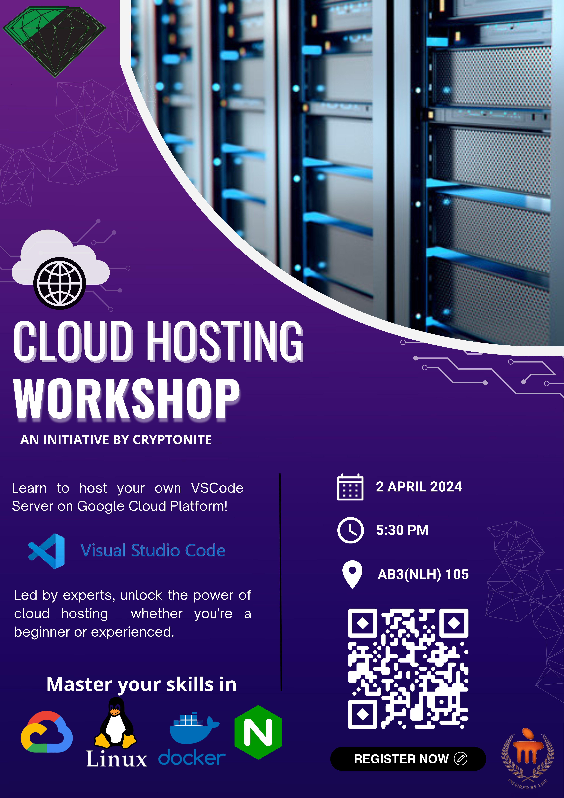

## Table of Contents

- [Cloud Hosting Workshop](#cloud-hosting-workshop)
  - [Table of Contents](#table-of-contents)
  - [1. Obtain a custom domain](#1-obtain-a-custom-domain)
  - [2. Set up your VM on GCP](#2-set-up-your-vm-on-gcp)
    - [a. Enable the free tier](#a-enable-the-free-tier)
    - [b. Create a free VM instance](#b-create-a-free-vm-instance)
    - [c. Allow port 81 through the firewall](#c-allow-port-81-through-the-firewall)
  - [2. Set up your VM on Azure](#2-set-up-your-vm-on-azure)
    - [c. Set up dynamic dns](#c-set-up-dynamic-dns)
  - [3. Install Docker on the VM](#3-install-docker-on-the-vm)
  - [4. Install nginx](#4-install-nginx)
    - [a. Use docker compose to spin up the container](#a-use-docker-compose-to-spin-up-the-container)
    - [b. Set up nginx](#b-set-up-nginx)
  - [5. Set up certificates and domains on nginx](#5-set-up-certificates-and-domains-on-nginx)
    - [a. Obtain a certificate](#a-obtain-a-certificate)
    - [b. Create a domain and link it to the admin panel](#b-create-a-domain-and-link-it-to-the-admin-panel)
  - [6. Install authelia](#6-install-authelia)
    - [a. Docker Compose](#a-docker-compose)
    - [b. Create the config file](#b-create-the-config-file)
    - [c. Create users database file](#c-create-users-database-file)
    - [d. Create the authelia container](#d-create-the-authelia-container)
  - [7. Set up authelia on nginx](#7-set-up-authelia-on-nginx)
  - [8. Install code-server](#8-install-code-server)
    - [a. Docker Compose for code-server](#a-docker-compose-for-code-server)
    - [b. Create domain on nginx](#b-create-domain-on-nginx)
  - [Resources](#resources)
    - [Reddit](#reddit)
    - [Youtube](#youtube)
    - [Github lists](#github-lists)

## 1. Obtain a custom domain

Until now, we have been using a lengthy IP Address to access our admin page. However, so that our page resembles more like an actual site, we will use a domain name. Domain names usually start at around 500 Rupees per year. If you want your own domain name, you can definitely purchase one. The free option is to use subdomains and that’s exactly what we’re going to do today.

- Visit [https://dynu.com](https://dynu.com) and make a free account.
- Once you have successfully verified your account, visit [https://www.dynu.com/en-US/ControlPanel/AddDDNS](https://www.dynu.com/en-US/ControlPanel/AddDDNS) to create your subdomain.

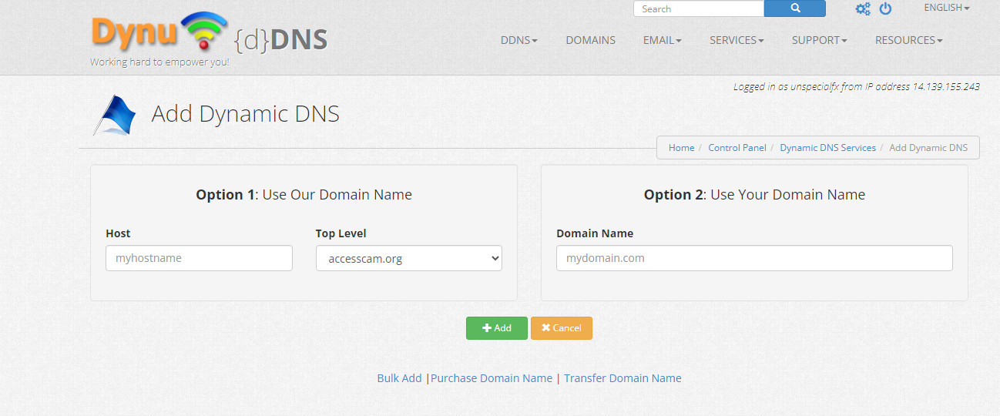

- Once you have created the subdomain of your choice, point it to the external IP of your VM. Paste the External IP of your VM in the IPv4 Address field and save it.

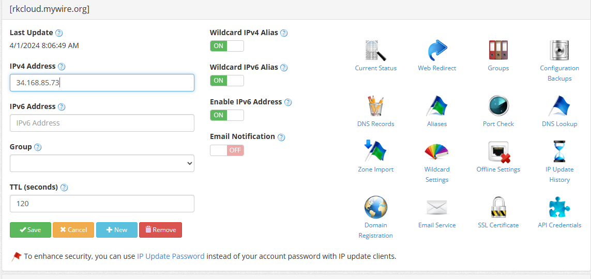

- Click on API Credentials (the puzzle icon) and Generate an API Key.

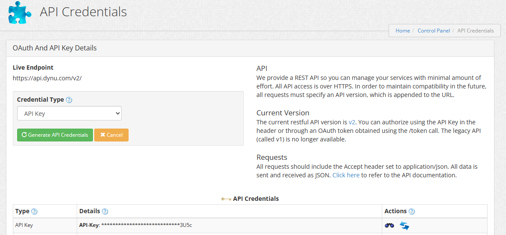

- Copy the API key somewhere safe as we will use it later.

## 2. Set up your VM on GCP

### a. Enable the free tier

- Visit [https://cloud.google.com/](https://console.cloud.google.com/)
- Enable the free tier by searching for it or visiting [https://console.cloud.google.com/freetrial/signup](https://console.cloud.google.com/freetrial/signup)


`
Start your free trial with $300 in credit. Don't worry – you won't be charged if you run out of credit.
`

- Enter your card details.

You will **NOT** be charged if you are only using the free tier. This is just so Google can verify its users for the free trial. You don’t have to worry about any expenses. **This is completely free.**

### b. Create a free VM instance

Follow these steps exactly to create a VM that qualifies for the free tier. You can keep using it as long as you want without being charged.

- Search for ‘Add VM Instance’ or visit this link: [https://console.cloud.google.com/compute/instancesAdd](https://console.cloud.google.com/compute/instancesAdd)

1. Name your VM
2. Select only these regions: us-west1, us-central1 and us-east1
3. Any zone within these regions is fine
4. Under 'Machine Configuration', select the E2 series.

5. Select the e2-micro Machine Type.

6. Change the boot disk size to 30 GB (only if your account has 1 VM!)

7. Enable HTTP and HTTPS Traffic under 'Firewall'
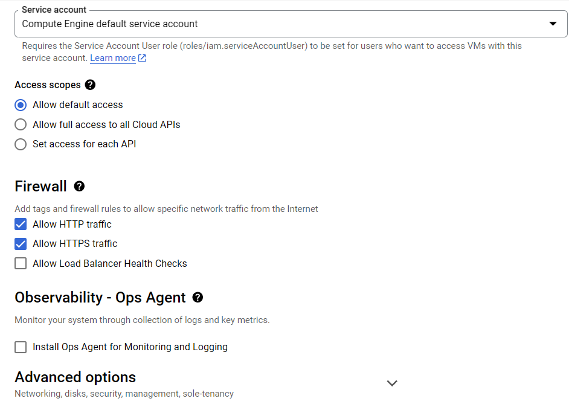
8. Expand 'Advanced Options' and under 'Networking' expand the default interface.
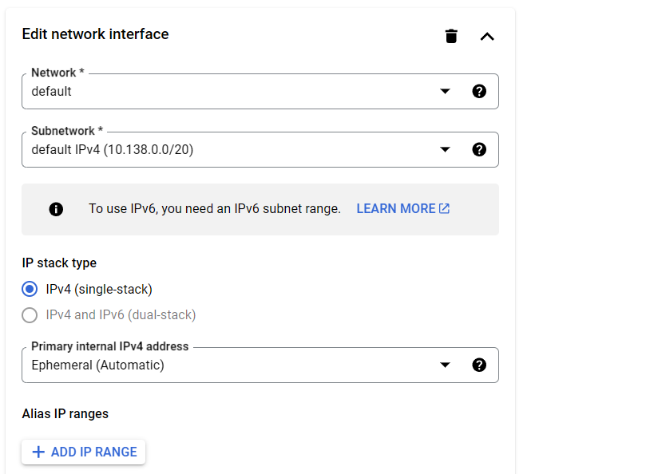
9. Click 'Reserve Static External IP address' in the 'External IPv4 address' option.
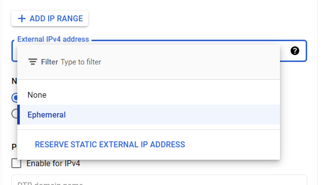
10. Enter a name for the IP address and click 'DONE' to save the IP.

11. Create the VM

### c. Allow port 81 through the firewall

- Configure your firewall to allow port 81 from the VM to be accessed.
- Search for firewall or visit [https://console.cloud.google.com/net-security/firewall-manager/firewall-policies/list](https://console.cloud.google.com/net-security/firewall-manager/firewall-policies/list)
- Create a new firewall rule. Make sure to select rule not policy

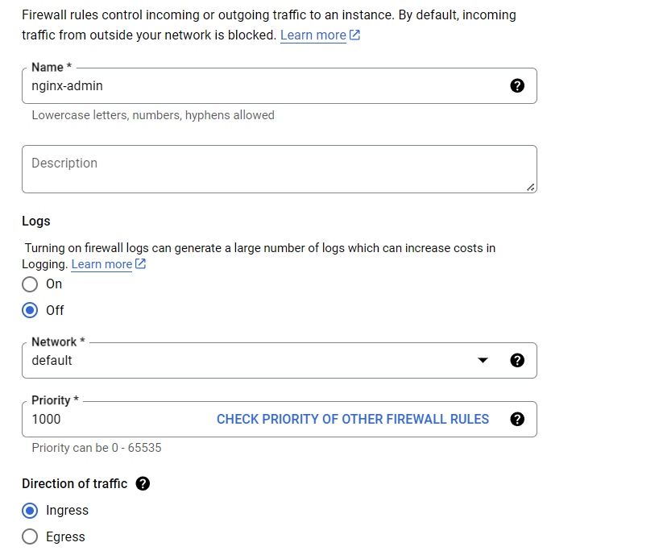

- Add the target tags as ‘http-server’ and https-server’
- Set the IPv4 range as 0.0.0.0/0. This will allow access to all IP addresses.

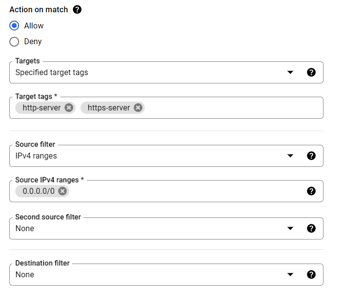

- Set the UDP and TCP ports to 81

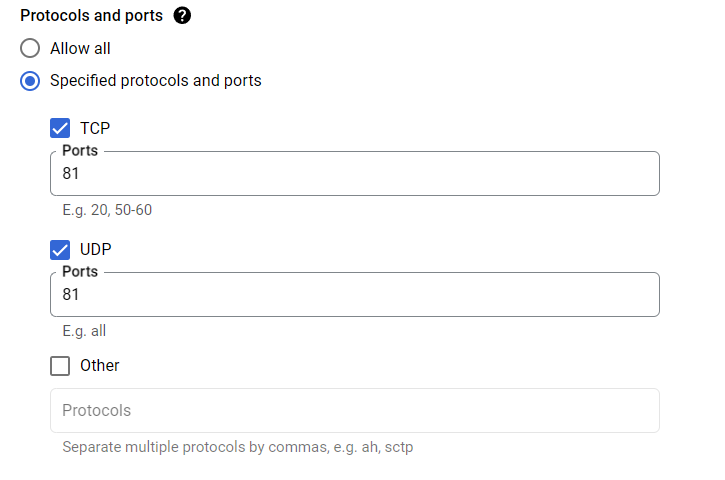

- Create the firewall rule

If you successfully set up your GCP VM, you can skip the Azure step.

## 2. Set up your VM on Azure

```plain
1 activate github student (can take b.w 1 day to week)
https://education.github.com/pack/offers
https://aka.ms/azure4students

2 create a vm in azure
size: Standard_B1s
make sure to create a new ssh keypair
in linux save it in ~/.ssh idk about windows

3 ssh into vm

----

it's way faster with azure cli but due to the keypair setup might have to use cli
keypair creation with cli https://learn.microsoft.com/en-us/cli/azure/sshkey?view=azure-cli-latest
^haven't tried ever

az group create -l centralindia -n resourceGroup1

az vm create \
--resource-group resourceGroup1\
--name cryptoniteWorkshop \
--admin-username azureuser \
--size Standard_B1s \
--os-disk-size-gb 30 \
--storage-sku StandardSSD_LRS \
--image Debian11 \
-o yamlc

enable port ingress for port 81
```

### c. Set up dynamic dns

- Install ddclient: Ensure ddclient is installed on your Linux machine. You can install it using your distribution's package manager. For example, on Ubuntu or Debian:

```bash
sudo apt update
sudo apt install ddclient
```

- Configure ddclient: Open or create the configuration file /etc/ddclient.conf with a text editor. Make sure it has appropriate permissions (readable only by root, for security reasons)

```bash
sudo nano /etc/ddclient.conf

```

- Update Configuration: Replace myusername with your Dynu username and YOURPASSWORD with your API key. Ensure you have your Dynu domain(s) listed correctly.

```config
# ddclient configuration for Dynu
#
# /etc/ddclient.conf
daemon=60                                                # Check every 60 seconds.
syslog=yes                                               # Log update msgs to syslog.
mail=root                                                # Mail all msgs to root.
mail-failure=root                                        # Mail failed update msgs to root.
pid=/var/run/ddclient.pid                                # Record PID in file.                                      
use=web, web=checkip.dynu.com/, web-skip='IP Address'    # Get ip from server.
server=api.dynu.com                                      # IP update server.
protocol=dyndns2                        
login=myusername                                         # Your username.
password=YOURPASSWORD                                    # Password or MD5/SHA256 of password.
MYDOMAIN.DYNU.COM                                        #CHANGE to your domain
```

- Save the Configuration File.

- Start ddclient Service: You might need to start or restart the ddclient service for the changes to take effect:

```bash
sudo service ddclient restart
```

## 3. Install Docker on the VM

- View all your VMs by visiting [https://console.cloud.google.com/compute/instances](https://console.cloud.google.com/compute/instances) or by searching ‘VM instances’ in the search bar
- Click SSH under the Connect column.
- Refer [https://docs.docker.com/engine/install/ubuntu/](https://docs.docker.com/engine/install/ubuntu/) to install docker engine or just copy-paste this block in the terminal. This will install the docker repository to allow you to get the latest version of docker.

```bash
# Add Docker's official GPG key:
sudo apt-get update
sudo apt-get install ca-certificates curl
sudo install -m 0755 -d /etc/apt/keyrings
sudo curl -fsSL https://download.docker.com/linux/debian/gpg -o /etc/apt/keyrings/docker.asc
sudo chmod a+r /etc/apt/keyrings/docker.asc

# Add the repository to Apt sources:
echo \
  "deb [arch=$(dpkg --print-architecture) signed-by=/etc/apt/keyrings/docker.asc] https://download.docker.com/linux/debian \
  $(. /etc/os-release && echo "$VERSION_CODENAME") stable" | \
  sudo tee /etc/apt/sources.list.d/docker.list > /dev/null
sudo apt-get update
```

- To install the latest version, run:

```bash
sudo apt-get install docker-ce docker-ce-cli containerd.io docker-buildx-plugin docker-compose-plugin
```

- Verify that the Docker Engine installation is successful by running the `hello-world` image.

```bash
sudo docker run hello-world
```

You have now successfully installed and started Docker Engine.

- Add your user to the docker group to use docker without sudo.

```bash
sudo groupadd docker
sudo usermod -aG docker $USER
newgrp docker
```

- Test by running hello-world again without sudo

```bash
docker run hello-world
```

## 4. Install nginx

### a. Use docker compose to spin up the container

There are two ways to run docker containers, either by using docker run or by using docker compose.

When you use docker run, you type the command docker run and enter the container details. I prefer using docker compose as all the container settings can be saved on the file and you can just run the file directly.

- Make a new folder called nginx

```bash
mkdir nginx

cd nginx
```

- In the folder, make a new file called docker-compose.yml We will use the nano text editor.

```bash
nano docker-compose.yml
```

- Copy this code

```yaml
---
version: "3.4"

networks:
  proxy:
    name: proxy

services:
  app:
    image: 'jc21/nginx-proxy-manager:latest'
    restart: unless-stopped
    container_name: nginx
    
    ports:
     - '80:80' # Public HTTP Port
     - '443:443' # Public HTTPS Port
     - '81:81' # Admin Web Port

    volumes:
      - ./data:/data
      - ./data/nginxx/snippets:/snippets:ro
      - ./data/nginx/site-confs:/site-confs:ro
      - ./letsencrypt:/etc/letsencrypt
    
    networks:
      - proxy
```

- Paste this into the nano window by pressing CTRL+SHIFT+V. Save it by pressing CTRL+O and then enter. Exit nano by pressing CTRL+X.

- Now, run the docker container by using docker compose:

```bash
docker compose up -d
```

### b. Set up nginx

- Note the external IP address of your VM by going to the ‘VM Instances’ page. Click on the External IP link to visit it. Add ’:81’ after the link to visit port 81. Change the URL to http instead of https.

  Example, if your IP is `34.168.85.73`, visit `http://34.168.85.73:81/`

- Login with the following details:

```Plain
Email:    admin@example.com
Password: changeme
```

- Change the default details, and ensure you use a strong password as security is very important.

## 5. Set up certificates and domains on nginx

### a. Obtain a certificate

- Visit the admin panel of nginx again.
- Navigate to the SSL Certificates page.
- Click on add SSL Certificate and select ‘Let’s Encrypt’.

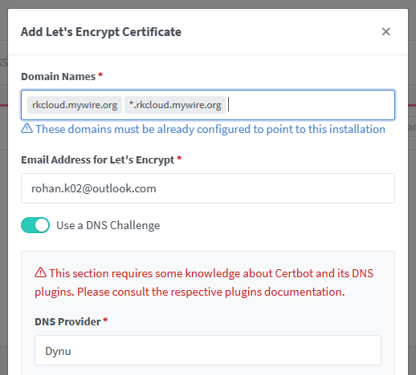

- Enter the custom subdomain that you created in the previous step. Also add another domain which is *. followed by the subdomain you created.
  
Example: `rkcloud.mywire.com` and `*.rkcloud.mywire.org`

- Enable ‘Use a DNS Challenge’.
- Select Dynu as the DNS Provider.
- Replace YOUR_DYNU_AUTH_TOKEN with the API Credential generated earlier.
  
Example: `dns_dynu_auth_token = b43as45bg633f64U5234Wf5g4d33c57`

- Leave the propagation seconds blank.
- Agree to the terms and conditions.
- This process may take a few minutes, so do not refresh the page until it is complete.
- If it isn’t generated successfully (the expiry date is red), delete it and try again.

### b. Create a domain and link it to the admin panel

- In the nginx admin panel, go to the ‘Proxy Hosts’ Page.
- Add a new proxy host. Under domain names, add nginx. followed by your subdomain.

Example: if your subdomain is `rkcloud.mywire.org`, create the domain name as `nginx.rkcloud.mywire.org`.

- Leave the scheme as http.
- type `nginx` under forward hostname. (we can directly use the hostname as the different containers will be under the same network and can be called by their container names instead of IPs.)
- Use `81` as the Forward Port.
- Enable ‘Cache Assets’, ‘Block Common Exploits’ and ‘Websockets Support’.

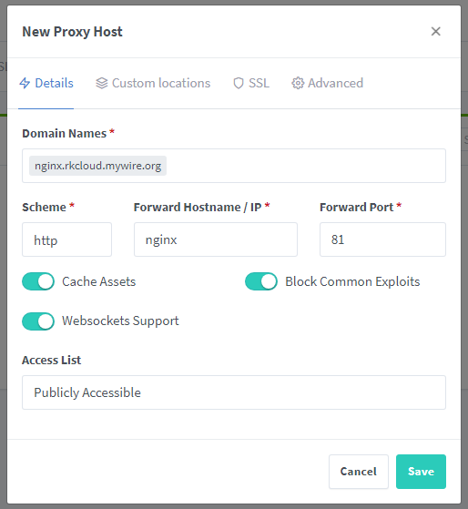

- In the SSL tab, select the certificate you created to enable HTTPS support.
- Enable all the other options.

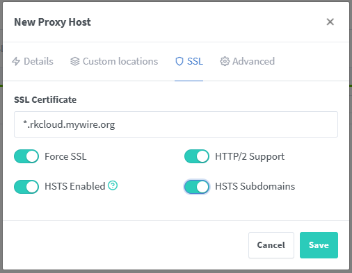

- Click save to create the domain.
- Click on the new domain to test it. It should load and be protected by HTTPS.

## 6. Install authelia

Before we install the code-server, we need to provide some authentication mechanism before we expose it to the internet. Authelia is a SSO (Single Sign On) tool that allows us to put out code-server behind a login.

### a. Docker Compose

- Navigate to the home directory on the server and create a folder called authelia

```bash
cd ~
mkdir authelia
cd authelia
```

- In the folder, make a new file called docker-compose.yml with the nano text editor.

```bash
nano docker-compose.yml
```

- Copy this code

```yaml
version: '3.3'

networks:
  proxy:
    external: true

services:
  authelia:
    image: authelia/authelia
    container_name: authelia
#   image: authelia/authelia:4.31
    volumes:
      - ./config:/config
    ports:
      - 9091:9091
    restart: unless-stopped
    healthcheck:
      disable: true
    environment:
      - TZ=Asia/Kolkata
    depends_on:
      - redis
    networks:
      - proxy

  redis:
    image: redis:alpine
    container_name: redis
    volumes:
      - ./redis:/data
    expose:
      - 6379
    restart: unless-stopped
    environment:
      - TZ=Asia/Kolkata
    networks:
      - proxy
```

- Paste this into the nano window by pressing CTRL+SHIFT+V. Save it by pressing CTRL+O and then enter. Exit nano by pressing CTRL+X.
- DO NOT run it with docker compose yet. We have to create the config files.

### b. Create the config file

- Create a new directory called config in the authelia folder.

```bash
mkdir config
cd config
```

- Paste this into notepad or any text editor on your computer. Don’t paste it in the VM as you will have to make some changes according to your subdomain.

```bash
##############################################################################
#                   Authelia configuration                                   #
##############################################################################

host: 0.0.0.0
port: 9091 # if you need this changed make sure it reflects also in the docker-compose.yml
jwt_secret: A4gYb7QFpbfKaNWAX7P7FX5y # CHANGE!! docker run authelia/authelia:latest authelia crypto rand --length 64 --charset alphanumeric
default_redirection_url: https://auth.rkcloud.mywire.org #CHANGE!!

authentication_backend:
  disable_reset_password: false
  file:
    path: /config/users_database.yml # Make sure this file exists
    password: 
      algorithm: argon2id
      iterations: 1
      salt_length: 16
      parallelism: 8
      memory: 64

access_control:
  default_policy: one_factor
  rules:
    # Rules applied to everyone
    - domain:
        - "https://auth.rkcloud.mywire.org" #CHANGE!!
      policy: bypass
    - domain: # Proxies only requiring username and password
        - "https://rkcloud.mywire.org" #CHANGE!!
      subject:
        - 'group:dev'
        - 'user:john' #CHANGE!!
      policy: one_factor
#      networks:
#        - 192.168.1.0/24
   # - domain: # Proxies needing 2 factor below
   #     - "proxmox.yourdomain.com"
   #   policy: two_factor
#      networks:
#         - 192.168.1.0/24
         
session:
  name: authelia_session
  # This secret can also be set using the env variables AUTHELIA_SESSION_SECRET_FILE
  secret: BEcQnvjxawGh4U9JgXBMXNVE
  expiration: 3600 # 1 hour
  inactivity: 7200 # 2 hours
  domain: rkcloud.mywire.org # CHANGE!! Needs to be your root domain

  redis:
    host: redis
    port: 6379
    # This secret can also be set using the env variables AUTHELIA_SESSION_REDIS_PASSWORD_FILE
#    password: authelia

regulation:
  max_retries: 5
  find_time: 2m
  ban_time: 10m

theme: dark   # options: dark, light

storage:
  encryption_key: y6PIvtsunfYFqgZzyZm5FfVBmykiHklWpszN92wvLBvhNGmXk7HgLvkOjW2Vj8m0
  local:
    path: /config/db.sqlite3
    
notifier:
  filesystem:
    filename: /config/notification.txt
#  smtp:
#    username: <your-user@your-email-domain.org>
#    password: <your-user-email-password-for-smtp>
#    host: <your-email-host-url-or-ip>
#    port: <your-email-port-for-smtp>  # 25 non-ssl, 443 ssl, 587 tls
#    sender: <sender@your-email-domain.org>
#    subject: "[Authelia] {title}"
#    disable_require_tls: false # set to true if your domain uses no tls or ssl only
#    disable_html_emails: false # set to true if you don't want html in your emails
#    tls:
#      server_name: <your-email-host-url-or-ip>
#      skip_verify: false
#      minimum_version: TLS1.2
```

- **Line 8 (jwt_secret)** - Maybe add or change a few letters/numbers.

- **Line 9 (default_redirection_url)** - add https://auth.your_subdomain.org to this.

  Example: if your subdomain is `rkcloud.mywire.org`, add `https://auth.rkcloud.mywire.org` to the field.

- **Line 26 (Access Control Domain 1)** - Change this to https://auth.your_subdomain.org as well.

  Example: if your subdomain is `rkcloud.mywire.org`, add `https://auth.rkcloud.mywire.org` to the field.

- **Line 29 (Access Control Domain 2)** - Change this to the subdomain only.

  Example: if your subdomain is `rkcloud.mywire.org`, add `https://rkcloud.mywire.org` to the field.

- **Line 32 (User)** - change this to your preferred username. Keep it simple and remember it as we will have to enter it exactly while creating the user database.  

- **Line 48 (session domain)** - Change this to your root domain name.

  Example: if your subdomain is `rkcloud.mywire.org`, add `rkcloud.mywire.org` to the field.

- In the VM, we are now in /authelia/config, Create a new config file called configuration.yml.

```bash
nano configuration.yml
```

- Paste the modified config into the nano window by pressing CTRL+SHIFT+V. Save it by pressing CTRL+O and then enter. Exit nano by pressing CTRL+X.

### c. Create users database file

- Paste this into notepad or any text editor on your computer. Don’t paste it in the VM as you will have to make some changes according to your username.

```yaml
###############################################################
#                         Users Database                      #
###############################################################
 
# This file can be used if you do not have an LDAP set up.
 
# List of users
users:
  john:
    displayname: "john doe"
    # SET password by generating hash with command
    #docker run authelia/authelia:latest authelia crypto hash generate --password 'YOURPASS'
    password: ""
    email: johndoe@gmail.com
    groups:
      - admins
      - dev
```

- **Line 9 (john)** - Change it to the username entered in the config file.

- **Line 10 (display name)** - Change it to the name of your choice.

- **Line 13 (password)** - Generate a password hash by using the command:

```bash
docker run authelia/authelia:latest authelia crypto hash generate --password 'YOURPASS'
```

in the VM terminal. Change YOURPASS to your desired password  and copy the generated hash to this field in between the double quotes.

- **Line 14 (email)** - Change it to your email

- Now we have to create the users_database.yml file. We should still be inside the /authelia/config directory.

```bash
nano users_database.yml
```

- Paste the following into users_database.yml and make sure to edit your name and email. Change ‘john’ to the username you used in the config file.

### d. Create the authelia container

- Within the ~/authelia directory, you can now run the docker-compose install.

```bash
cd ~/authelia
docker compose up -d
```

## 7. Set up authelia on nginx

Now that we have started authelia, we need to create its domain name on nginx so we can access it from the browser.

- In the nginx admin panel, go to the ‘Proxy Hosts’ Page.
- Add a new proxy host. Under domain names, add auth. followed by your subdomain.

  Example: if your subdomain is `rkcloud.mywire.org`, create the domain name as `auth.rkcloud.mywire.org`.

- Leave the scheme as http.
- type `authelia` under forward hostname. (we can directly use the hostname as the different containers will be under the same network and can be called by their container names instead of IPs.)
- Use `9091` as the Forward Port.
- Enable ‘Cache Assets’, ‘Block Common Exploits’ and ‘Websockets Support’.

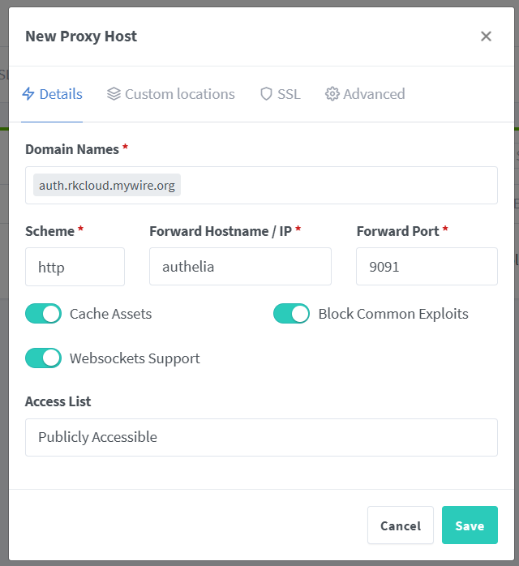

- In the SSL tab, select the certificate you created to enable HTTPS support.
- Enable all the other options.

- In the advanced tab, paste the following code. This allows authelia to recieve information about the user like IP, etc. It also enables Authelia to act as an authenticator.

```perl
location / {
set $upstream_authelia http://authelia:9091; # This example assumes a Docker deployment 
proxy_pass $upstream_authelia;
client_body_buffer_size 128k;

#Timeout if the real server is dead
proxy_next_upstream error timeout invalid_header http_500 http_502 http_503;

# Advanced Proxy Config
send_timeout 5m;
proxy_read_timeout 360;
proxy_send_timeout 360;
proxy_connect_timeout 360;

# Basic Proxy Config
proxy_set_header Host $host;
proxy_set_header X-Real-IP $remote_addr;
proxy_set_header X-Forwarded-For $proxy_add_x_forwarded_for;
proxy_set_header X-Forwarded-Proto $scheme;
proxy_set_header X-Forwarded-Host $http_host;
proxy_set_header X-Forwarded-Uri $request_uri;
proxy_set_header X-Forwarded-Ssl on;
proxy_redirect  http://  $scheme://;
proxy_http_version 1.1;
proxy_set_header Connection "";
proxy_cache_bypass $cookie_session;
proxy_no_cache $cookie_session;
proxy_buffers 64 256k;

# If behind a reverse proxy, forwards the correct IP, assumes you're using Cloudflare. Adjust IP for your Docker network.
set_real_ip_from 172.18.0.0/16;
real_ip_header X-Forwarded-For;
real_ip_recursive on;
}
```

Do not edit anything that is not mentioned below unless you know exactly what you are doing

- Visit the domain for authelia, and test your username and password.

## 8. Install code-server

### a. Docker Compose for code-server

- Navigate to the home directory on the server and create a folder called code-server

```bash
cd ~
mkdir code-server
cd code-server
```

- In the folder, make a new file called docker-compose.yml with the nano text editor.

```bash
nano docker-compose.yml
```

- Copy this code

```yaml
---
version: "3.4"

networks:
  proxy:
    external: true

volumes:
  code_server_data:
    name: code_server_data

services:
  code-server:
    image: lscr.io/linuxserver/code-server:latest
    container_name: code-server
    restart: unless-stopped

    environment:
      - PUID=1000
      - PGID=1000
      - TZ=Asia/Kolkata
      # - PASSWORD=password #optional
      # - HASHED_PASSWORD=$$argon2i$$v=19$$m=4096,t=3,p=1$$R000UThTSmNkeDd2OTVLNQ$$saltedpasshash #optional
      - SUDO_PASSWORD=ZsudoZ556Z #optional
      # - SUDO_PASSWORD_HASH= #optional
      - PROXY_DOMAIN=code.rkcloud.mywire.org #CHANGE!!
      - DEFAULT_WORKSPACE=/config/workspace #optional
      - CS_DISABLE_GETTING_STARTED_OVERRIDE=false
      - CS_DISABLE_TELEMERTY=1

    volumes:
      - code_server_data:/config

    # ports:
    #   - 8556:8443
    
    networks:
      - proxy
```

- Make sure to change the proxy domain to your subdomain.
  
  Example: if your subdomain is `rkcloud.mywire.org`, create the domain name as `code.rkcloud.mywire.org`.
- Paste this into the nano window by pressing CTRL+SHIFT+V. Save it by pressing CTRL+O and then enter. Exit nano by pressing CTRL+X.
- Within the ~/code-server directory, you can now run the docker-compose install.

```bash
cd ~/code-server
docker compose up -d
```

### b. Create domain on nginx

- In the nginx admin panel, go to the ‘Proxy Hosts’ Page.
- Add a new proxy host. Under domain names, add code. followed by your subdomain.

    Example: if your subdomain is `rkcloud.mywire.org`, create the domain name as `code.rkcloud.mywire.org`.

- Leave the scheme as http.
- type `code-server` under forward hostname. (we can directly use the hostname as the different containers will be under the same network and can be called by their container names instead of IPs.)
- Use `8443` as the Forward Port.
- Enable ‘Cache Assets’, ‘Block Common Exploits’ and ‘Websockets Support’.

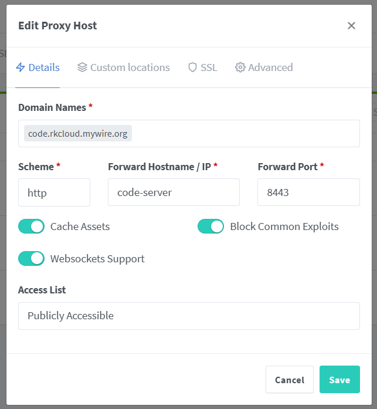

- In the SSL tab, select the certificate you created to enable HTTPS support.
- Enable all the other options.

- Paste the following code in a notepad or a text editor. You will have to make some changes so be careful.

```perl
location /authelia {
internal;
set $upstream_authelia http://authelia:9091/api/verify;
proxy_pass_request_body off;
proxy_pass $upstream_authelia;    
proxy_set_header Content-Length "";

# Timeout if the real server is dead
proxy_next_upstream error timeout invalid_header http_500 http_502 http_503;
client_body_buffer_size 128k;
proxy_set_header Host $host;
proxy_set_header X-Original-URL $scheme://$http_host$request_uri;
proxy_set_header X-Real-IP $remote_addr;
proxy_set_header X-Forwarded-For $remote_addr; 
proxy_set_header X-Forwarded-Proto $scheme;
proxy_set_header X-Forwarded-Host $http_host;
proxy_set_header X-Forwarded-Uri $request_uri;
proxy_set_header X-Forwarded-Ssl on;
proxy_redirect  http://  $scheme://;
proxy_http_version 1.1;
proxy_set_header Connection "";
proxy_cache_bypass $cookie_session;
proxy_no_cache $cookie_session;
proxy_buffers 4 32k;

send_timeout 5m;
proxy_read_timeout 240;
proxy_send_timeout 240;
proxy_connect_timeout 240;
}

location / {
set $upstream_app $forward_scheme://$server:$port;
proxy_pass $upstream_app;

auth_request /authelia;
auth_request_set $target_url https://$http_host$request_uri;
auth_request_set $user $upstream_http_remote_user;
auth_request_set $email $upstream_http_remote_email;
auth_request_set $groups $upstream_http_remote_groups;
proxy_set_header Remote-User $user;
proxy_set_header Remote-Email $email;
proxy_set_header Remote-Groups $groups;

# CHANGE!!
error_page 401 =302 https://auth.rkcloud.mywire.org/?rd=$target_url;

client_body_buffer_size 128k;

proxy_next_upstream error timeout invalid_header http_500 http_502 http_503;

send_timeout 5m;
proxy_read_timeout 360;
proxy_send_timeout 360;
proxy_connect_timeout 360;

proxy_set_header Host $host;
proxy_set_header Upgrade $http_upgrade;
proxy_set_header Connection upgrade;
proxy_set_header Accept-Encoding gzip;
proxy_set_header X-Real-IP $remote_addr;
proxy_set_header X-Forwarded-For $proxy_add_x_forwarded_for;
proxy_set_header X-Forwarded-Proto $scheme;
proxy_set_header X-Forwarded-Host $http_host;
proxy_set_header X-Forwarded-Uri $request_uri;
proxy_set_header X-Forwarded-Ssl on;
proxy_redirect  http://  $scheme://;
proxy_http_version 1.1;
proxy_set_header Connection "";
proxy_cache_bypass $cookie_session;
proxy_no_cache $cookie_session;
proxy_buffers 64 256k;

set_real_ip_from 172.18.0.0/16;
set_real_ip_from 172.19.0.0/16;
real_ip_header CF-Connecting-IP;
real_ip_recursive on;

}
```

- **Line 45 (error page)** - Change this to the auth subdomain.

Example: if your subdomain is `rkcloud.mywire.org`, add `https://auth.rkcloud.mywire.org` to the field.

Voila! 🎉🎉

## Resources

### Reddit

- [r/selfhosted](https://www.reddit.com/r/selfhosted/)
- [selfhosted wiki - Getting Started](https://adrift.space/r-selfhosted/wiki/)
- [r/homelab](https://www.reddit.com/r/homelab/)

### Youtube

- [Christian Lempa](https://www.youtube.com/@christianlempa)
- [DBTech](https://www.youtube.com/@DBTechYT)
- [Tech Hut](https://www.youtube.com/@TechHut)
- [Techno Tim](https://www.youtube.com/@TechnoTim)

### Github lists

- [Awesome Selfhosted](https://github.com/awesome-selfhosted/awesome-selfhosted)
- [Awesome sysadmin](https://github.com/awesome-foss/awesome-sysadmin)
- [Awesome Docker](https://github.com/veggiemonk/awesome-docker)
